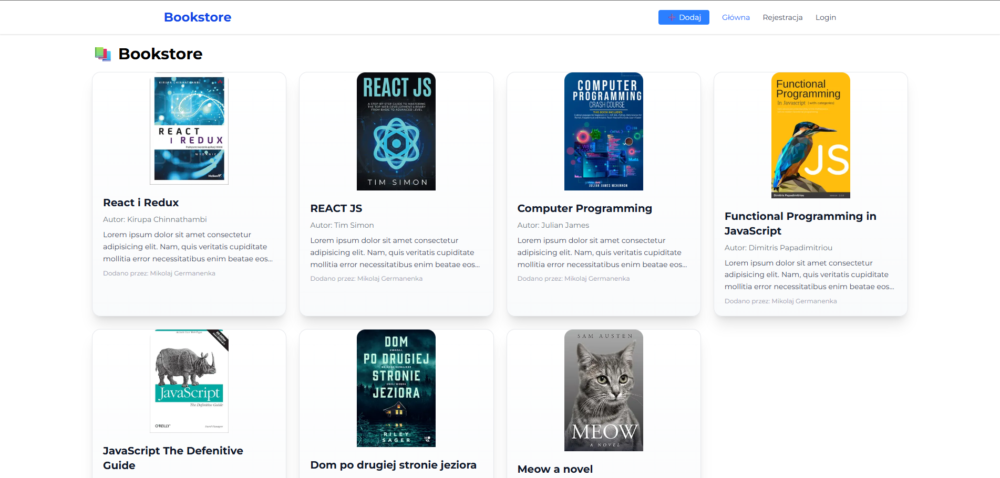

# Arkusz Projektowania Aplikacji

| Sekcja                                       | Szczegóły                                                                                                                 |
| -------------------------------------------- | ------------------------------------------------------------------------------------------------------------------------- |
| **Pracownik Nadzorujący Kontakt z Klientem** | Mikołaj Germanenka                                                                                                        |
| Imię i Nazwisko                              | Mikołaj Germanenka                                                                                                        |
| Adres email                                  | kolyangermanenko@gmail.com                                                                                                |
| **Szczegółowe Dane**                         |                                                                                                                           |
| Nazwa Klienta                                | luvtorn's org                                                                                                             |
| Dane Klienta                                 | firma luvtorn's org                                                                                                       |
| **Uwagi Podstawowe**                         |                                                                                                                           |
| Typ aplikacji                                | Aplikacja webowa do zarządzania książkami                                                                                 |
| Framework                                    | Next.js 15 + React                                                                                                        |
| Backend                                      | API routes (Next.js) + Prisma + PostgreSQL                                                                                |
| **Opis Dodatkowy**                           |                                                                                                                           |
| Cel projektu                                 | Stworzenie aplikacji do zarządzania bazą książek z funkcją logowania użytkowników i możliwością dodawania własnych wpisów |
| **Wygląd Aplikacji**                         |                                                                                                                           |
| Zrzuty ekranu                                |                                                                                                                            |
| **Identyfikacja Wizualna**                   |                                                                                                                           |
| Kolor Wiodący                                | #1D4ED8 (niebieski)                                                                                                       |
| Kolor Drugi                                  | 	#FFFFFF (biały)                                                                                                                           |
| Kolor Trzeci                                 |	#F1F5F9 (jasnoszary)                                                                                                                           |
| Logo                                         |  	Nie dotyczy (można dodać w przyszłości)                                                                                                                         |
| **Funkcjonalność Aplikacji**                 |                                                                                                                           |
| Baza danych                                  | Tak (PostgreSQL przez Prisma)                                                                                                                       |
| Logowanie                                    | 	Tak (z walidacją)                                                                                                                       |
| System rejestracji na stronie                | Tak                                                                                                                       |
| Menu mobilne                                 | Tak                                                                                                                       |
| Menu desktop                                 | Tak                                                                                                                       |
| Dodawanie książek                            | Tak                               |
| Edycja książek  | Tak |
| Usuwanie książek | Tak|
| Przesyłanie obrazów| Tak|
| Hosting z domeną| Tak|

> **Uwagi**:  
> W przyszłości aplikacja może być rozwinięta o dodatkowe funkcjonalności, takie jak filtrowanie książek, system ocen, tagowanie lub integrację z zewnętrznymi API książek.
