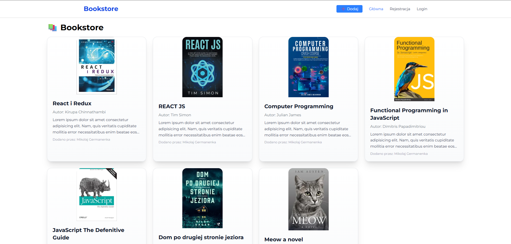
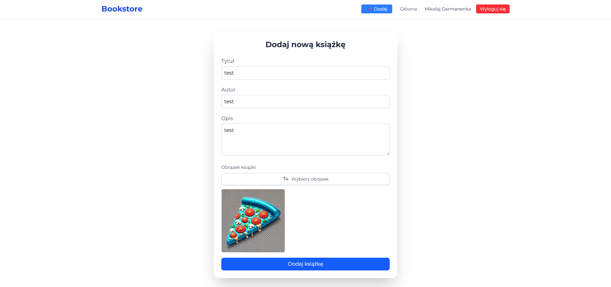

# 📘 Specyfikacja Projektu: Aplikacja Webowa do Dodawania Książek

**Wykonał**: Mikolaj Germanenka  
**Ostatnia modyfikacja**: 06.06.2025
**Firma**: (projekt indywidualny/internship)

---

## Spis Treści

1. [Opis Produktu](#1-opis-produktu)
2. [Część Graficzna (Frontend)](#2-część-graficzna-frontend)
3. [Funkcjonalność Programu Komputerowego](#3-funkcjonalność-programu-komputerowego)
4. [Baza Technologiczna (Backend)](#4-baza-technologiczna-backend)
5. [Programowanie Obiektowe](#5-programowanie-obiektowe)
6. [Zasoby Pracownicze](#6-zasoby-pracownicze)
7. [Wsparcie dla Programistów](#7-wsparcie-dla-programistów)
8. [Procedury Koordynacyjne](#8-procedury-koordynacyjne)

---

## 1. Opis Produktu

Projekt polega na stworzeniu responsywnej aplikacji internetowej umożliwiającej zarejestrowanym użytkownikom dodawanie, przeglądanie i komentowanie książek.
System umożliwia użytkownikowi utworzenie konta, zalogowanie się oraz wprowadzenie książki z takimi danymi jak tytuł, autor, gatunek, opis oraz okładka.
System pozwala również na przeglądanie listy książek i szczegółów wybranej książki.

## 2. Część Graficzna (Frontend)

**Interfejs Użytkownika**:
  - Strona logowania i rejestracji.
  - Panel główny z listą książek (siatka kart lub lista).

- Formularz dodawania książki:

    - Tytuł

    - Autor

    - Rok wydania

    - Opis

    - Gatunek (z listy rozwijanej)

    - Okładka (upload)

- Szczegóły książki — osobna podstrona z pełnymi informacjami.

- Komentarze do książki (opcjonalnie).

- **Technologie Frontendowe**:
  - ReactJS z hookami (useState, useEffect)
  - React Router DOM do obsługi tras
  - Axios do komunikacji z API
  - TailwindCSS lub MUI jako system styli

  
  

## 3. Funkcjonalność Programu Komputerowego

**Obsługa książek**:

  - Wyświetlanie wszystkich książek
  - Dodawanie nowej książki (formularz)
  - (Opcjonalnie) Edytowanie i usuwanie książki przez autora

**Obsługa użytkowników**:
  - Rejestracja (e-mail, hasło)
  - Logowanie
  - Uwierzytelnianie JWT
  - Autoryzacja dla operacji dodawania/edytowania

---

## 4. Baza Technologiczna (Backend)

Poniżej dokładny opis wykorzystywanych technologii:

- **Technologie Backendowe**:

  - App Routes (Next.JS).
  - Użycie Prisma do łatwego zarządzania konfiguracją.

- **Baza Danych**:

  - PostgreSql (Neon) jako baza danych.
  - Supabase do przechowywania zdjec
  - Tabele:
    * **users** – użytkownicy (id, email, hasło, imie)
    * **books** – książki (id, tytuł, autor, opis, user_id, image_id)

- **Komunikacja API**:
  REST API:
    - **GET /api/books** – lista książek
    - **GET /api/books/{id}** – szczegóły książki
    - **POST /api/books** – dodanie książki
    - **POST /api/auth/register, login** – autentykacja
---

## 5. Programowanie Obiektowe

### Klasy (Entity):

- User – użytkownik
- Book – książka

### Serwisy:
- BookService, UserService, AuthService
---

## 6. Zasoby Pracownicze

Autor projektu: Mikolaj Germanenka

Frontend i Backend Developer: Mikolaj Germanenka

## 7. Wsparcie dla Programistów

### Narzędzia zewnętrzne:
- Postman – testowanie endpointów

- JWT.io – testowanie tokenów

- GitHub – repozytorium kodu

- Vercel – hosting backendu i frontendu

---